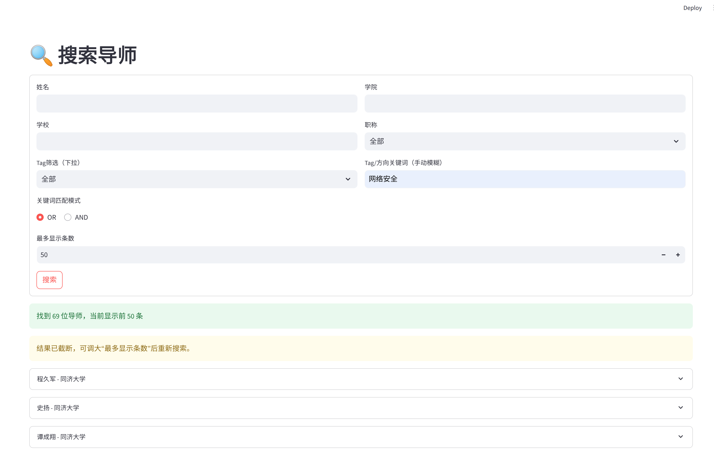

# Find My Director

本地查询中国高校导师信息的网页工具。
目前只有部分院校的工科学院，faculty.db会在github上持续更新

## 快速开始

```bash
git clone <repository-url> && cd find_my_director
pip install -r requirements.txt
streamlit run web/app.py
```

浏览器打开 **[http://localhost:8501](http://localhost:8501)** 即可搜索。
建议使用Tag/方向关键词+学校名称进行搜索



## 当前数据覆盖

所有数据均来自**各学校官方院系网站**，目前收录部分工科学院：东南大学、南京大学、同济大学、浙江大学。

## 更新数据

直接替换根目录下的 `faculty.db` 文件，刷新页面即生效。

数据库为标准 SQLite 文件，`teachers` 表结构如下：

| 字段 | 说明 |
|------|------|
| `name` | 姓名 |
| `school` | 学校 |
| `college` | 学院 |
| `title` | 职称 |
| `email` | 邮箱 |
| `research` | 研究方向 |
| `tag` | 标签（逗号分隔或 JSON 数组） |

## 环境要求

- Python 3.8+

## 免责声明

本项目数据均为个人整理，仅供参考，不保证信息的准确性与时效性，请以各学校官网为准。

## 许可证

MIT License
